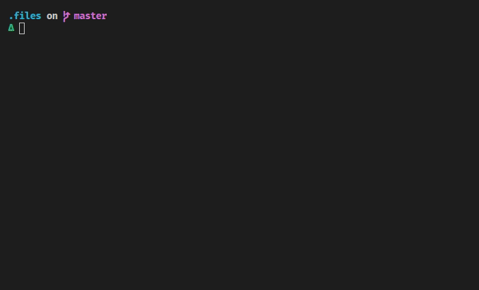

<div align="center">
  
  
  
</div>

<h1 align="center">
  <strong>dotfiles</strong>
</h1>

`dotfiles` will sanely setup a machine, and provide quality of life improvements.

## :gear: Installation
```bash
git clone https://github.com/DJRHails/dotfiles.git ~/.files
cd ~/.files
./bootstrap.sh
```

<div align="center">



</div>

## :package: Modules


## :zap: Inspired by
- [@holman](https://github.com/holman/dotfiles)
- [@alrra](https://github.com/alrra/dotfiles)
- [@denisdoro](https://github.com/denisidoro/dotfiles)
