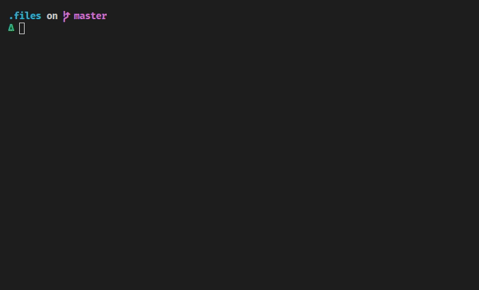

<div align="center">
  
  
  
</div>

<h1 align="center">
  <strong>.files</strong>
</h1>

`.files` will sanely setup a machine, and provide quality of life improvements.

## :gear: Installation
```bash
git clone --recurse-submodules https://github.com/DJRHails/dotfiles.git ~/.files
cd ~/.files
./bootstrap.sh --cli --yes

# Custom config
./bootstrap.sh
```

<div align="center">



</div>

## :package: Modules

| Module                  | Description
| ----------------------- | -----------
| :sparkle: `agents`      | Shared coding-agent config — AGENTS.md, skills, commands, and subagents, symlinked into each agent's config dir.
| `alwayson`              | Keep a macOS machine awake (pmset, with backup/restore).
| `askllm`                | Ask an LLM from the terminal (git submodule behind `bin/askllm`).
| :sparkle: `claude`      | Claude Code setup — settings, guardrail hooks, MCP servers, statusline.
| `cloudflared`           | Cloudflare Tunnel client via signed apt repo.
| `code`                  | VS Code settings.
| `docker`                | Docker runtime via Colima (macOS) or Docker Engine (Linux).
| `execblock`             | Execute code blocks from markdown files (`bin/execblock`).
| `explaincron`           | Explain crontab entries (`bin/explaincron`).
| `gdrive`                | Google Drive mount via ocamlfuse.
| `ghostty`               | Ghostty terminal config.
| :sparkle: `git`         | Git aliases, user-level config, and GitHub ssh/gpg onboarding.
| `gpu-vm`                | On-demand cloud GPU pods over ssh, with cron-based idle reaping.
| `keybase`               | Keybase client.
| `node`                  | Node.js via NodeSource signed repo.
| `pentest`               | Aliases useful in penetration tests / deobfuscation.
| `pi`                    | pi coding agent config.
| `piknik`                | Cross-machine clipboard.
| `python`                | python3, uv, and virtualenv quality-of-life aliases.
| `raycast`               | Raycast (macOS launcher).
| `rust`                  | Rust toolchain via rustup, plus cargo tools.
| `slurm`                 | Slurm helper aliases for GPU clusters.
| :sparkle: `ssh`         | ssh config template for commonly used machines.
| `tailscale`             | Tailscale VPN (exit-node advertising is opt-in).
| `tesseract`             | OCR via tesseract + imagemagick (`bin/ocr`).
| `vim`                   | vim & vim config.
| `zellij`                | Zellij terminal multiplexer with durable remote sessions.
| :sparkle: `zsh`         | zsh, aliases, completion, and the glue that loads every module's `*.zsh`.

### Dependencies

A module declares what it needs in its own `deps.conf` — one module name per
line, `#` comments and blank lines ignored:

```bash
# modules/claude/deps.conf
# install.sh installs `ant` with install::go_tool, which needs the go toolchain.
go
```

`bootstrap.sh` resolves those declarations before installing anything:
dependencies are pulled in even when you didn't select them (`./bootstrap.sh
claude` also installs `go`), and the install order is topologically sorted so a
module always runs after everything it depends on. Modules with no dependency
relationship keep the order you asked for.

Resolution failures abort the run rather than degrade — a dependency naming a
module that doesn't exist, or a cycle:

```
   [✖] module dependencies cannot be resolved (cycle detected)
   [✖]   claude -> go -> claude
   [✖]   unresolvable modules: claude go
```

Current edges:

| Module       | Needs           | Why
| ------------ | --------------- | ---
| `agents`     | `python`        | `skills/` ships `uv run` and `python3` entrypoints.
| `claude`     | `go`            | `install.sh` installs `ant` with `install::go_tool`.
| `claude`     | `node`          | `mcp.json` launches playwriter and context7 with `npx`.
| `claude`     | `python`        | `settings.json` registers four `python3 .../hooks/*.py` hooks.
| `execblock`  | `python`        | `bin/execblock` runs `uv run`.
| `explaincron`| `python`        | `bin/explaincron` builds its venv with `python3 -m venv`.
| `git`        | `rust`          | `setup.sh` seeds `~/.git-template` with `prek`, a cargo tool.
| `git`        | `ssh`           | `setup.github.sh` appends to `~/.ssh/config`, a symlink the ssh module owns.
| `gpu-vm`     | `ssh`           | The `Host gpu*` stanzas live in `modules/ssh/config.tmpl`.
| `pi`         | `node`          | `install.sh` uses `npm install -g`.
| `python`     | `git`           | `install.sh` writes `init.templateDir` into `~/.gitconfig.local`.
| `zellij`     | `python`        | `install.*.sh` installs `humane` with `uv tool install`.

Shipping a `*.zsh` fragment is deliberately **not** an edge: `zshrc` globs
`$DOTFILES/modules/*/*.zsh` over the repo tree at shell startup, so nothing is
resolved at install time and 13 identical `→ zsh` edges would make `zsh` a
mandatory graph root that buries the real ordering constraints.

Run `bash tests/module-deps.test.sh` to check the graph still resolves.

## :zap: Inspired by
- [@holman](https://github.com/holman/dotfiles)
- [@alrra](https://github.com/alrra/dotfiles)
- [@denisdoro](https://github.com/denisidoro/dotfiles)
